# Methodology

## Analyse

* **Waveform**
    
    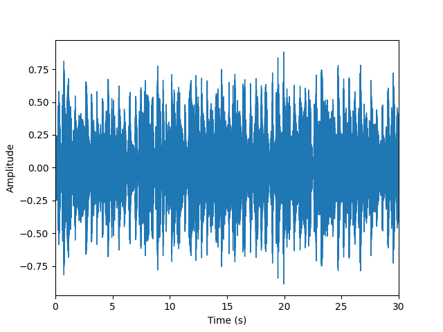
* **FFT Spectrum** 
    
    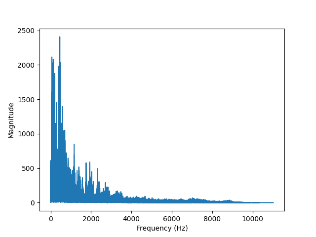
* **Log Spectogram** 
    
    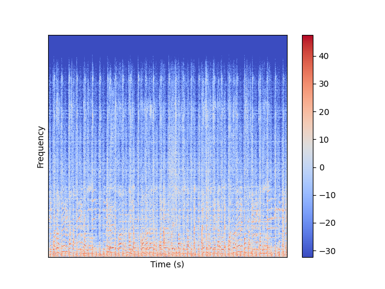
* **MFCC** 
    
    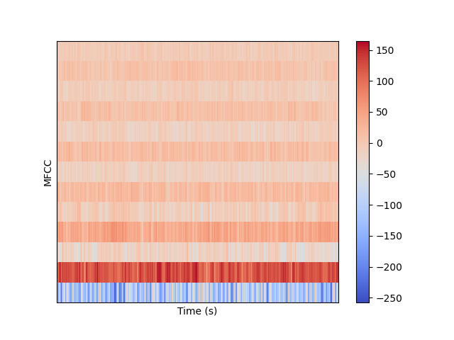

***

## Preprocess

* divided each `.wav` file into 5 segments to increse training data.
* exctracted mfcc for each segment.
* stored the complete dataset in format :
    ```json
    {
        "mapping" : ["classical","blues",...],
        "mfcc": [[[...],[...],...,[...]],...],
        "labels": [0,2,...]
    }
    ```
***

### Simple ANN

* **Architecture** 
    
    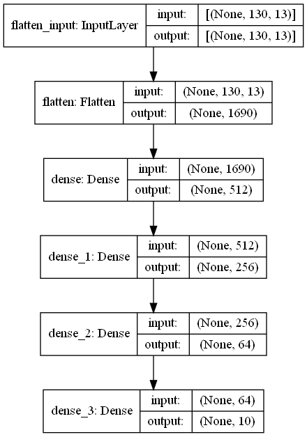

* **Result** 
    
    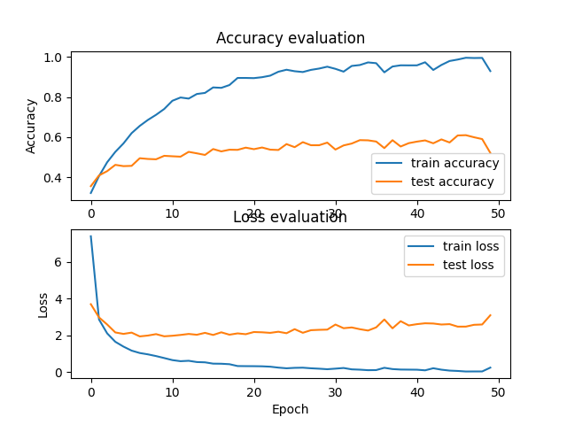

* **Comments** : 
    - As we can see, the model is overfitting.

***

### Simple ANN with Dropout and Kernel Regularization

* **Architecture** 
    
    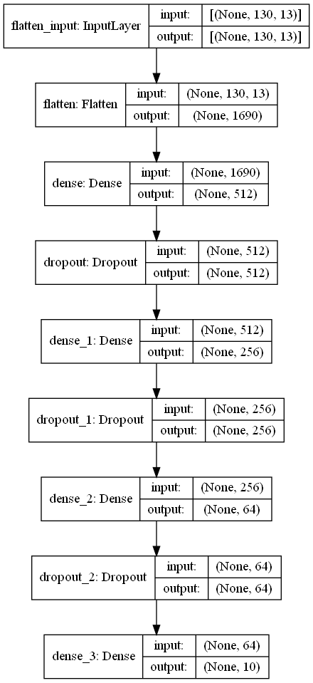

* **Result** 
    
    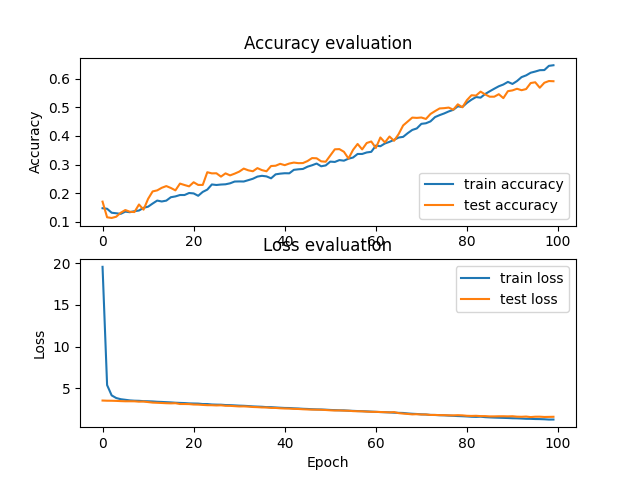

* **Comments** :
    - The model is not overfitting anymore.

***

### Convolutional Neural Network

* **Architecture** 
    
    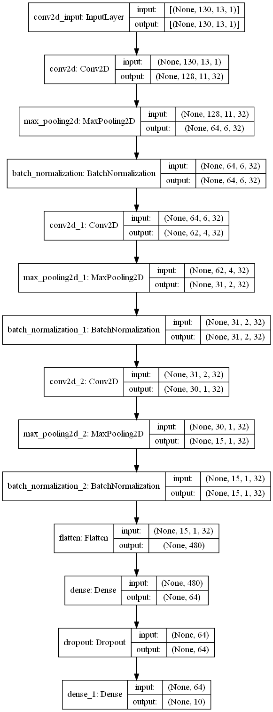

* **Result** 
    
    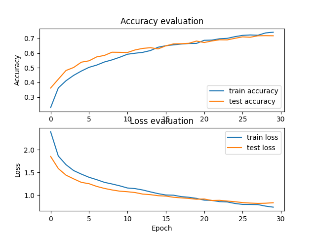

* **Comments** :
    - CNN performs very well.
    - The training data had to be reshaped since CNN required 3 dimensional input.
    - Fastest

***

### Recurrent Neural Network (LSTM)

* **Architecture** 
    
    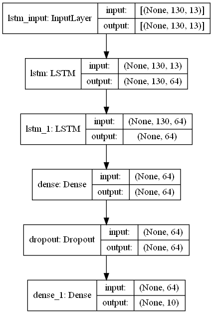

* **Result** 
    
    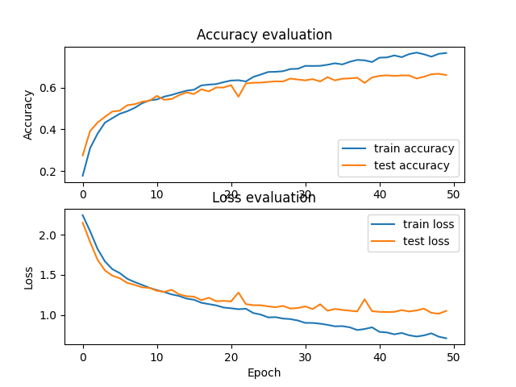

* **Comments** :
    - LSTM performs very well.
    - Slowest

***

### Recurrent Neural Network (GRU)

* **Architecture** 
    
    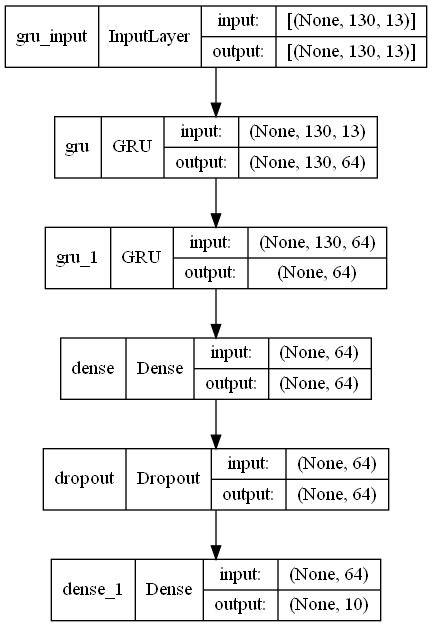

* **Result** 
    
    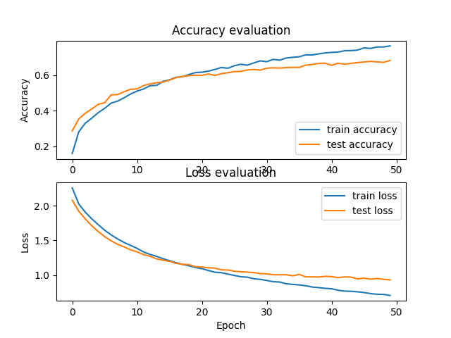

* **Comments** :
    - GRU performs very well. Better than LSTM.
    - Slowest (as slow as LSTM)